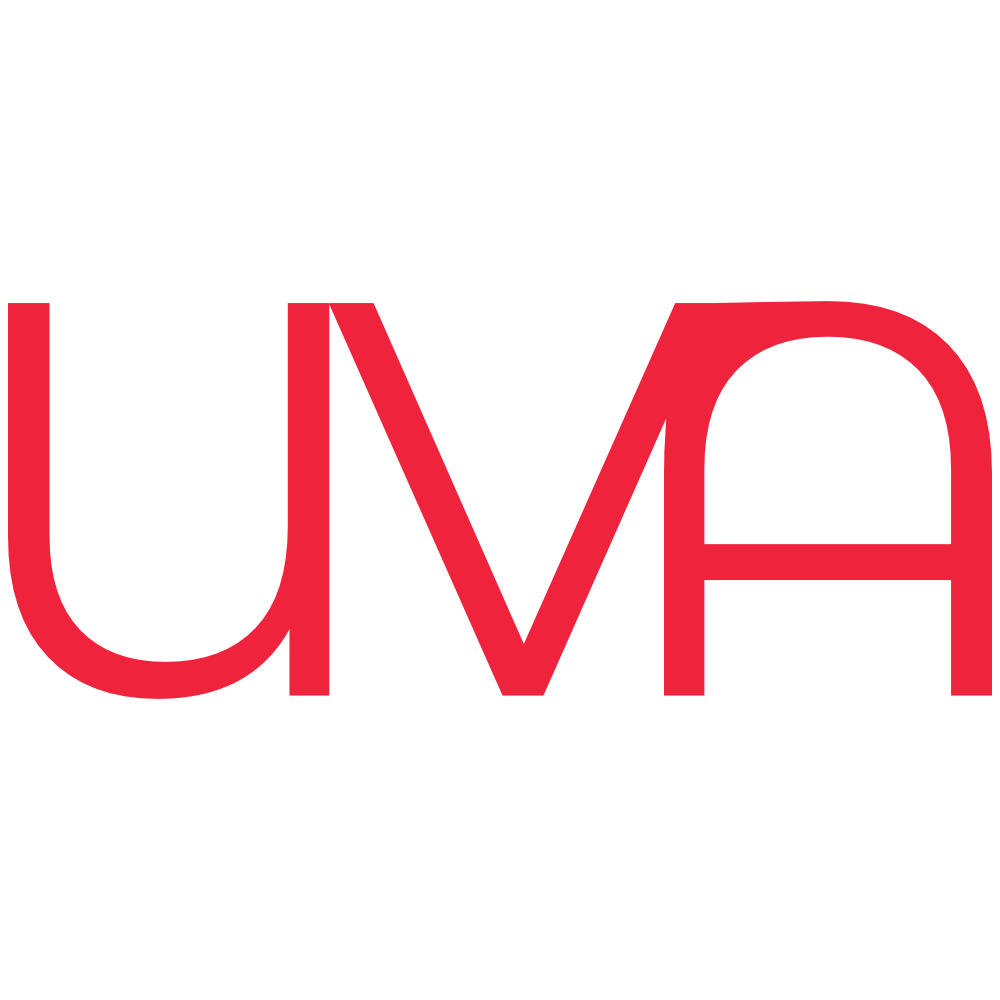

# Uva Lang

<p align="center">

</p>

**Uva** is a programming language I'm building to learn programming language design and other related fields

# Syntax
```d
// Comment
var a : int = 1;
var b : int = 2;


function sum(a : int, b:int){
	return a + b - a;
}
function main(){
	sum(a + b);
}
```

# Features
* Strongly Typed
* Interpreted
* Desirable and Easy-To-Learn Syntax

# Todo(mandatory)
❗ - On Progress

✔️ - Done

❌ - Untouched
## Missing Functionalities(work on progress)
* Conditions and Loops ❌
* Standard Library ❌
* AST Working Program ✔️
* Lexer ❗
* Parser ❗
* Typechecker ❌


# Todo(but not mandatory)
* Make it compiled using PyInstaller and AST Structures
* Compile it to custom bytecode [**PyVM**](https://github.com/unknown989/PyVM)
* Re-Program the language in itself